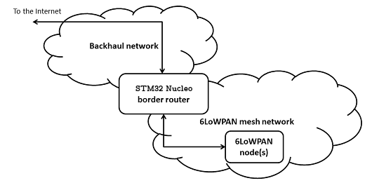
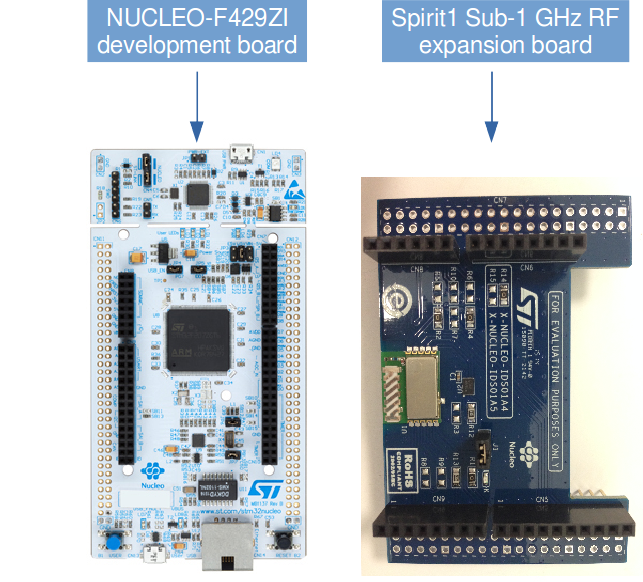

# STM32 Nucleo Border Router

## Currently supported boards
 * [NUCLEO-F429ZI](http://www.st.com/content/st_com/en/products/evaluation-tools/product-evaluation-tools/mcu-eval-tools/stm32-mcu-eval-tools/stm32-mcu-nucleo/nucleo-f429zi.html) + [X-NUCLEO-IDS01A4](http://www.st.com/content/st_com/en/products/ecosystems/stm32-open-development-environment/stm32-nucleo-expansion-boards/stm32-ode-connect-hw/x-nucleo-ids01a4.html)

**Note**, in order to run this border router application on the `NUCLEO_F429ZI` development board you need to perform the following HW modifications on it:
* **Open** solder bridge `SB121`
* **Close** solder bridge `SB122`
 
Furthermore, the RF expansion board `X-NUCLEO-IDS01A4` requires these HW modifications:
* **Un**mount resistor `R4`
* **Mount** resistor `R7`

## Introduction

This document describes how to configure, compile, and run this 6LoWPAN border router application on a STM32 Nucleo development board, especially the [NUCLEO-F429ZI](https://developer.mbed.org/platforms/ST-Nucleo-F429ZI/), together with the [X-NUCLEO-IDS01A4](https://github.com/ARMmbed/stm-spirit1-rf-driver) Sub-1 GHz RF expansion board (*a.k.a.* Spirit1). 

<span class="notes">**Note:** This Border Router does not support Thread.

Border router is a network gateway between a wireless 6LoWPAN mesh network and a backhaul network. It controls and relays traffic between the two networks. In a typical setup, a 6LoWPAN border router is connected to another router in the backhaul network (over Ethernet or a serial line) which in turn forwards traffic to/from the internet or a private company LAN, for instance.



## Software components

The STM32 Nucleo border router application consists of 4 software components as shown in the image below:


* [Nanostack Border Router](https://github.com/ARMmbed/nanostack-border-router) is the core IPv6 gateway logic and provides the mesh network functionality.
* [Spirit1 RF driver](https://github.com/ARMmbed/stm-spirit1-rf-driver) is the driver for the STM Spirit1 wireless 6LoWPAN expansion boards.
* [Ethernet driver](https://github.com/ARMmbed/sal-nanostack-driver-stm32-eth) is the Ethernet driver for the STM32 Nucleo development board.
* [SLIP driver](https://github.com/ARMmbed/sal-stack-nanostack-slip) is a generic Serial Line Internet Protocol version 6 (SLIPv6) driver for mbedOS boards.

## Required hardware

* Two STM32 Nucleo development boards (currently only NUCLEO-F429ZI boards are supported), one for the border router application and another one for [the 6LoWPAN mbed client application](https://github.com/ARMmbed/mbed-os-example-client).
* Two STM Spirit1 Sub-1 GHz RF expansion boards [X-NUCLEO-IDS01A4](http://www.st.com/content/st_com/en/products/ecosystems/stm32-open-development-environment/stm32-nucleo-expansion-boards/stm32-ode-connect-hw/x-nucleo-ids01a4.html) for wireless 6LoWPAN mesh connectivity.
* Two micro-USB cables to connect the development boards to a PC for debugging and power.
* An Ethernet cable to connect the development board to a backhaul network.



## Required software

* [mbed-cli](https://github.com/ARMmbed/mbed-cli#installing-mbed-cli) command line interface.
* A compiler. Use one of the following:
    * [GCC ARM Embedded](https://launchpad.net/gcc-arm-embedded).
    * [ARM Compiler](https://developer.arm.com/products/software-development-tools/compilers/arm-compiler-5/downloads). (Requires license)
* [mbed account](https://www.mbed.com).
* A GitHub account.

## Optional software

* [PuTTY](http://www.chiark.greenend.org.uk/~sgtatham/putty/download.html) for serial terminal emulation, see [serial connection settings](#serial-connection-settings).
* [Wireshark](https://www.wireshark.org/) for packet inspection and network debugging.
* [mbed Windows serial port driver](https://developer.mbed.org/handbook/Windows-serial-configuration), a serial driver for Windows to enable serial connections.


## Configuration

To configure the STM32 Nucleo border router you need to make changes in the application configuration file `mbed_app.json` in the root directory of the source tree. For the complete list of configuration options, refer to the [Nanostack Border Router](https://github.com/ARMmbed/nanostack-border-router) documentation.

```json
    "config": {
        "heap-size": {
             "help": "The amount of static RAM to reserve for nsdynmemlib heap",
             "value": 50000
        },
        "debug-trace": "false",
        "trace-baud-rate": "115200",
        "backhaul-driver": "ETH",
        "backhaul-mac-src": "BOARD",
        "backhaul-mac": "{0x02, 0x00, 0x00, 0x00, 0x00, 0x01}"
    }
```

#### Backhaul connectivity

The STM32 Nucleo border router application can be connected to a backhaul network. This enables you to connect the devices in a 6LoWPAN mesh network to the internet or a private LAN. Currently, the application supports SLIP (IPv6 encapsulation over a serial line) and Ethernet backhaul connectivity. 

You can select your preferred option through the `mbed_app.json` file (field *backhaul-driver* in the *config* section). Value `SLIP` includes the SLIP driver, while the value `ETH` compiles the STM32 Nucleo border router application with Ethernet backhaul support. You can define the MAC address on the backhaul interface manually (field *backhaul-mac-src* value `CONFIG`). Alternatively, you can use the MAC address provided by the development board (field *backhaul-mac-src* value `BOARD`). By default, the backhaul driver is set to be `ETH` and the MAC address source is `BOARD`. 

You can also set the bakchaul bootstrap mode (field *backhaul-bootstrap-mode*). By default, the bootstrap mode is set to be `NET_IPV6_BOOTSTRAP_AUTONOMOUS`. With autonomous mode, the border router learns the prefix information automatically from an IPv6 gateway in the ethernet/SLIP segment. Optionally, you can set the bootsrap mode to be `NET_IPV6_BOOTSTRAP_STATIC` which enables you to set up  a manual configuration of backhaul-prefix and default-route.

If you use static bootstrap mode, you need to configure a default route on the backhaul interface to properly forward packets between the backhaul and the 6LoWPAN mesh network. In addition to this, you need to set a backhaul prefix. Static mode creates a site-local IPv6 network from where packets cannot be routed outside.

 For more details on how to set the backhaul prefix and default route, refer to the [Nanostack Border Router](https://github.com/ARMmbed/nanostack-border-router) documentation.

When using the autonomous mode, you can set the `prefix-from-backhaul` option in the `mbed_app.json`file to `true` to use the same bakchaul prefix on the mesh network side as well. This allows for the mesh nodes to be directly connectable from the outside of the mesh network.

####Note on the SLIP backhaul driver

You need to use the UART1 serial line of the K64F board with the SLIP driver. See the *pins* section in the project's yotta configuration. To use a different UART line, replace the *SERIAL_TX* and *SERIAL_RX* values with correct TX/RX pin names. 
If you wish to use hardware flow control, set the configuration field `slip_hw_flow_control``to `true`. By default, it is set to `false`. Before using hardware flow control, make sure that the other end of your SLIP interface can handle flow control.

For the pin names of your desired UART line, refer to the [STM32 Nucleo documentation](https://developer.mbed.org/platforms/ST-Nucleo-F429ZI/).

Example `mbed_app.json` configuration for the SLIP driver:

```json
    "config": {
  	    "SERIAL_TX": "SERIAL_TX",
    	"SERIAL_RX": "SERIAL_RX",
    	"SERIAL_CTS": "PD_11",
    	"SERIAL_RTS": "PD_12"
    }
```

### Switching the RF shield

By default the application uses the Spirit1 RF driver. You can alternatively use the Atmel AT86RF233/212B RF or the FRDM-MCR20A shield also. The used RF driver is set in the `mbed_app.json` file.

To use the STM Spirit1 radio, use following:
```json
    "config": {
        "radio-type":{
            "help": "options are SPIRIT1, ATMEL, MCR20",
            "value": "SPIRIT1"
        }
    }
```

To use the Atmel radio, use following:
```json
    "config": {
        "radio-type":{
            "help": "options are SPIRIT1, ATMEL, MCR20",
            "value": "ATMEL"
        }
    }
```

To use the NXP radio, use following:
```json
    "config": {
        "radio-type":{
            "help": "options are SPIRIT1, ATMEL, MCR20",
            "value": "MCR20"
        }
    }
```

In case you have choosen the STM Spirit1 Sub-1 GHz RF expansion board [X-NUCLEO-IDS01A4](https://github.com/ARMmbed/stm-spirit1-rf-driver), you need also to configure its MAC address in the `mbed_app.json` file, e.g.:
```json
    "target_overrides": {
        "*": {
            "spirit1.mac-address": "{0xf0, 0xf1, 0xf2, 0xf3, 0xf4, 0xf5, 0xf6, 0xf7}"
        },
    }
```

Note, that this MAC address must be unique within the 6LoWPAN mesh network.

After changing the radio, you need to recompile the application.

## Build instructions

1. Install [mbed-cli](https://github.com/ARMmbed/mbed-cli)
2. Clone the repository: `git clone https://github.com/ARMmbed/stm32-border-router.git`
3. Change directory to `stm32-border-router`
4. Modify the `mbed_app.json` file to reflect to your network setup
5. Deploy required libraries: `mbed deploy`
6. Generate mbed application root: `mbed new .`
7. Build: `mbed compile -m NUCLEO_F429ZI -t GCC_ARM`

The binary will be generated into `BUILD/NUCLEO_F429ZI/GCC_ARM/stm32-border-router.bin`.

## Running the border router application

1. Find the  binary file `stm32-border-router.bin` in the folder `BUILD/NUCLEO_F429ZI/GCC_ARM/`.
2. Copy the binary to the USB mass storage root of the STM32 Nucleo development board. It is automatically flashed to the target MCU. When the flashing is complete, the board restarts itself. Press the **Reset** button of the development board if it does not restart automatically.
3. The program begins execution.
4. Open the [serial connection](#serial-connection-settings), for example PuTTY.

## Serial connection settings

Serial connection settings for the border router application are as follows:

	* Baud-rate = 115200
	* Data bits = 8
	* Stop bits = 1
	* flow control = xon/xoff

If there is no input from the serial terminal, press the **Reset** button of the development board.

In the PuTTY main screen, save the session and click **Open**. This opens a console window showing debug messages from the application. If the console screen is blank, you may need to press the **Reset** button of the board to see the debug information. The prints for the border router look something like this in the console:

```
[INFO][app ]: Starting NUCLEO_F429ZI border router...
[INFO][app ]: Using ETH backhaul driver...
[ERR ][brro]: Backhaul interface down failed
[INFO][Eth ]: Ethernet cable connected.
[INFO][addr]: Tentative Address added to IF 2: fe80::280:e1ff:fe3e:42
[INFO][addr]: DAD passed on IF 2: fe80::280:e1ff:fe3e:42
[INFO][addr]: Tentative Address added to IF 2: 2001:470:1f13:280:280:e1ff:fe3e:42
[INFO][addr]: DAD passed on IF 2: 2001:470:1f13:280:280:e1ff:fe3e:42
[INFO][brro]: Backhaul bootstrap ready, IPv6 = 2001:470:1f13:280:280:e1ff:fe3e:42
[INFO][brro]: Backhaul interface addresses:
[INFO][brro]:    [0] fe80::280:e1ff:fe3e:42
[INFO][brro]:    [1] 2001:470:1f13:280:280:e1ff:fe3e:42
[INFO][addr]: Address added to IF 1: fe80::ff:fe00:face
[INFO][br  ]: BR nwk base ready for start
[INFO][br  ]: Refresh Contexts
[INFO][br  ]: Refresh Prefixs
[INFO][addr]: Address added to IF 1: 2001:470:1f13:280:0:ff:fe00:face
[INFO][addr]: Address added to IF 1: fe80::f2f1:f2f3:f4f5:f6f7
[INFO][brro]: RF bootstrap ready, IPv6 = 2001:470:1f13:280:0:ff:fe00:face
[INFO][brro]: RF interface addresses:
[INFO][brro]:    [0] fe80::ff:fe00:face
[INFO][brro]:    [1] fe80::f2f1:f2f3:f4f5:f6f7
[INFO][brro]:    [2] 2001:470:1f13:280:0:ff:fe00:face
[INFO][brro]: 6LoWPAN Border Router Bootstrap Complete.
```
